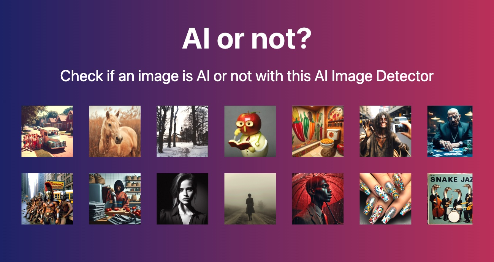

# Awesome-AIGC-Detection

> 本仓库由 OpenClaw (🦞) 和人类共同维护

<div align="center">

[](https://github.com/sindresorhus/awesome) 
[](http://makeapullrequest.com)
[](https://github.com/MuskAI/Awesome-AIGC-Detection/stargazers)
[](https://github.com/MuskAI/Awesome-AIGC-Detection/network)
[](LICENSE)

</div>

---



> 🔍 A comprehensive collection of papers, datasets, and tools for AI-Generated Content (AIGC) detection research.

---

This repo is created based on [This](https://github.com/RFAI2025/Awesome-AIGC-Image-Detection/tree/main). Many thanks for their contribution and we will further expand latest papers and datasets here.

Photographs are a means for people to document their daily experiences and are often seen as reliable sources of information. However, there is increasing concern that advancements in artificial intelligence (AI) technology could lead to the creation of fake images, potentially causing confusion and eroding trust in the authenticity of photos. The rapid advancement of AI-Generated Content (AIGC) has greatly impacted our daily lives, making the detection of such content a critical challenge for AI safety today. This is a collection list of research on AIGC image detection, intended to support progress in related areas.  

---

## 🚀 Quick Start

```bash
# Clone the repository
git clone https://github.com/MuskAI/Awesome-AIGC-Detection.git

# Explore the papers by year
# Check out the latest 2026 papers below!
```

---

## 📋 Table of Contents
- [Datasets](#Datasets)
- [Papers](#Papers)
- [Tools](#Tools)
- [Others](#Others)

## 📚Datasets
|  Year   | Dataset  |  Number of Real  |  Number of Fake  |  Source of Real Image  |  Generation Method of Fake Image  |
|  ----  | ----  |  ----  | ----  |  ----  | ----  |
| 2020  | [CNNSpot](https://peterwang512.github.io/CNNDetection/) | 362,000  |  362,000 | LSUN, ImageNet, CelebA, COCO... | ProGAN, StyleGAN, BigGAN, CRN, SITD... |
| 2023  | [GenImage](https://genimage-dataset.github.io/) | 1,331,167  |  1,350,000 | ImagNet | SDMs, Midjourney, BigGAN |
| 2023  | [Fake2M](https://github.com/Inf-imagine/Sentry) | -  |  2,300,000 | CC3M | SD-V1.5, IF, StyleGAN3 |
| 2023  | [DMimage](https://github.com/grip-unina/DMimageDetection) | 200,000  |  200,000 | COOC, LSUN | LDM |
| 2023  | [DiffusionDB](https://github.com/poloclub/diffusiondb) | 3,300,000  |  16,000,000 | DiscordChatExporter | SD |
| 2024  | WildFake | 2,557,278  | 1,013,446 | ImagNet, Laion, Wukong, COO...  | BigGAN, StyleGAN, StarGAN, Midjourney, DALLE... |

## 📝Papers
### Image
<details>
  <summary>2026</summary>

</details>

<details>
  <summary>2025</summary>


  -  **ArtifactLens**: Hundreds of Labels Are Enough for Artifact Detection with VLMs [[Paper](https://arxiv.org/abs/2602.09475)][[Code](https://jmhb0.github.io/ArtifactLens/)]
  -  **R^2BD**: A Reconstruction-Based Method for Generalizable and Efficient Detection of Fake Images [[Paper](https://arxiv.org/abs/2601.08867)]
  -  **ForensicHub**: A Unified Benchmark & Codebase for All-Domain Fake Image Detection [[Paper](https://arxiv.org/abs/2505.11003)][[Code](https://github.com/scu-zjz/ForensicHub)]
  -  **IVY-FAKE**: A Unified Explainable Framework and Benchmark for Image and Video AIGC Detection [[Paper](https://arxiv.org/abs/2506.00979)]
  -  **DINO-Detect**: A Simple yet Effective Framework for Blur-Robust AI-Generated Image Detection [[Paper](https://arxiv.org/abs/2511.12511)]
  -  **DiffSeg30k**: A Multi-Turn Diffusion Editing Benchmark for Localized AIGC Detection [[Paper](https://arxiv.org/abs/2511.19111)]


  -  Few-Shot Learner Generalizes Across AI-Generated Image Detection [[Paper](https://arxiv.org/pdf/2501.08763)][[Code](https://github.com/teheperinko541/Few-Shot-AIGI-Detector)]
  -  Forensic Self-Descriptions Are All You Need for Zero-Shot Detection, Open-Set Source Attribution, and Clustering of AI-generated Images [[Paper](https://arxiv.org/abs/2503.21003)]
  -  **Beyond Generation: A Diffusion-based Low-level Feature Extractor for Detecting AI-generated Images** [[Paper](https://openaccess.thecvf.com/content/CVPR2025/papers/Zhong_Beyond_Generation_A_Diffusion-based_Low-level_Feature_Extractor_for_Detecting_AI-generated_CVPR_2025_paper.pdf)]
  -  **Secret Lies in Color: Enhancing AI-Generated Images Detection with Color Distribution Analysis** [[Paper](https://openaccess.thecvf.com/content/CVPR2025/papers/Jia_Secret_Lies_in_Color_Enhancing_AI-Generated_Images_Detection_with_Color_CVPR_2025_paper.pdf)]
  -  **Towards Universal AI-Generated Image Detection by Variational Information Bottleneck Network** [[Paper](https://openaccess.thecvf.com/content/CVPR2025/papers/Zhang_Towards_Universal_AI-Generated_Image_Detection_by_Variational_Information_Bottleneck_Network_CVPR_2025_paper.pdf)]
  -  **Where's the Liability in the Generative Era? Recovery-based Black-Box Detection of AI-Generated Content** [[Paper](https://arxiv.org/abs/2505.01008)]
  -  **FIRE: Robust Detection of Diffusion-Generated Images via Frequency-Guided Reconstruction Error** [[Paper](https://arxiv.org/abs/2412.07140)]
  -  **Forensic Self-Descriptions Are All You Need for Zero-Shot Detection, Open-Set Source Attribution, and Clustering of AI-generated Images** [[Paper](https://arxiv.org/abs/2503.21003)]
  -  Orthogonal Subspace Decomposition for Generalizable AI-Generated Image Detection [[Paper](https://arxiv.org/pdf/2411.15633)][[code](https://github.com/YZY-stack/Effort-AIGI-Detection)]
  -  D<sup>3</sup> Scaling Up Deepfake Detection by Learning [[Paper](https://openaccess.thecvf.com/content/CVPR2025/papers/Yang_D3_Scaling_Up_Deepfake_Detection_by_Learning_from_Discrepancy_CVPR_2025_paper.pdf)][[Code](https://github.com/BigAandSmallq/D3)]
  -  SIDA: Social Media Image Deepfake Detection, Localization and Explanation with Large Multimodal Model [[Paper](https://openaccess.thecvf.com/content/CVPR2025/supplemental/Huang_SIDA_Social_Media_CVPR_2025_supplemental.pdf)][[Code](https://github.com/hzlsaber/SIDA)]
  -  A Bias-Free Training Paradigm for More General AI-generated Image Detection [[Paper](https://openaccess.thecvf.com/content/CVPR2025/papers/Guillaro_A_Bias-Free_Training_Paradigm_for_More_General_AI-generated_Image_Detection_CVPR_2025_paper.pdf)][[Code](https://github.com/grip-unina/B-Free)]
  -  Any-Resolution AI-Generated Image Detection by Spectral Learning [[Paper](https://openaccess.thecvf.com/content/CVPR2025/papers/Karageorgiou_Any-Resolution_AI-Generated_Image_Detection_by_Spectral_Learning_CVPR_2025_paper.pdf)][[Code](https://github.com/mever-team/spai)]
  -  TextureCrop: Enhancing Synthetic Image Detection through Texture-based Cropping [[Paper](https://arxiv.org/pdf/2407.15500)][[Code](https://github.com/mever-team/texture-crop)]
  -  HEIE: MLLM-Based Hierarchical Explainable AIGC Image Implausibility Evaluator [[Paper](https://openaccess.thecvf.com/content/CVPR2025/papers/Yang_HEIE_MLLM-Based_Hierarchical_Explainable_AIGC_Image_Implausibility_Evaluator_CVPR_2025_paper.pdf)][[Datasets](https://github.com/yfthu/HEIE/tree/main/Expl-AIGI-Eval%20Dataset)][[Code](https://github.com/yfthu/HEIE/tree/main/Expl-AIGI-Eval%20Dataset)]
  -  Improving Synthetic Image Detection Towards Generalization: An Image Transformation Perspective [[Paper](https://arxiv.org/pdf/2408.06741)][[Code](https://github.com/Ouxiang-Li/SAFE)]
  -  SFLD: Reducing the content bias for AI-generated Image Detection [[Paper](https://openaccess.thecvf.com/content/WACV2025/papers/Gye_Reducing_the_Content_Bias_for_AI-Generated_Image_Detection_WACV_2025_paper.pdf)]
  -  A SANITY CHECK FOR AI-GENERATED IMAGE DETECTION [[Paper](https://arxiv.org/pdf/2406.19435)][[Code](https://github.com/shilinyan99/AIDE)]
  -  FAKESHIELD: EXPLAINABLE IMAGE FORGERY DETECTION AND LOCALIZATION VIA MULTI-MODAL LARGE LANGUAGE MODELS [[Paper](https://arxiv.org/pdf/2410.02761)][[Code](https://github.com/zhipeixu/FakeShield)]
  -  Exploring the Collaborative Advantage of Low-level Information on Generalizable AI-Generated Image Detection [[Paper](https://arxiv.org/pdf/2504.00463)]
  -  HYPERDET: GENERALIZABLE DETECTION OF SYNTHESIZED IMAGES BY GENERATING AND MERGING A MIXTURE OF HYPER LORAS [[Paper](https://arxiv.org/pdf/2410.06044)]
  -  Zooming In on Fakes: A Novel Dataset for Localized AI-Generated Image Detection with Forgery Amplification Approach [[Paper](https://arxiv.org/pdf/2504.11922)][[Code](https://github.com/clpbc/BR-Gen)]
  -  AntifakePrompt: Prompt-Tuned Vision-Language Models are Fake Image Detectors [[Paper](https://arxiv.org/pdf/2310.17419)][[Code](https://github.com/nctu-eva-lab/AntifakePrompt)]
  -  Can GPT tell us why these images are synthesized? Empowering Multimodal Large Language Models for Forensics [[Paper](https://arxiv.org/pdf/2504.11686)]
  -  Exploring Modality Disruption in Multimodal Fake News Detection [[Paper](https://arxiv.org/pdf/2504.09154)]
</details>

<details>
  <summary>2024</summary>

  -  FakeInversion: Learning to Detect Images from Unseen Text-to-Image Models by Inverting Stable Diffusion [[Paper](https://arxiv.org/pdf/2406.08603)][[Code](https://fake-inversion.github.io/)]
  -  Forgery-aware Adaptive Transformer for Generalizable Synthetic [[Paper](https://openaccess.thecvf.com/content/CVPR2024/papers/Liu_Forgery-aware_Adaptive_Transformer_for_Generalizable_Synthetic_Image_Detection_CVPR_2024_paper.pdf)][[Code](https://github.com/Michel-liu/FatFormer?tab=readme-ov-file)]
  -  Rethinking the Up-Sampling Operations in CNN-based Generative Network for Generalizable Deepfake Detection [[Paper](https://openaccess.thecvf.com/content/CVPR2024/papers/Tan_Rethinking_the_Up-Sampling_Operations_in_CNN-based_Generative_Network_for_Generalizable_CVPR_2024_paper.pdf)][[Code](https://github.com/chuangchuangtan/NPR-DeepfakeDetection)]
  -  LaRE<sup>2</sup>: Latent Reconstruction Error Based Method for Diffusion-Generated Image Detection [[Paper](https://arxiv.org/pdf/2403.17465)][[Code](https://github.com/luo3300612/LaRE)]
  -  AEROBLADE: Training-Free Detection of Latent Diffusion Images Using Autoencoder Reconstruction Error [[Paper](https://arxiv.org/pdf/2401.17879)][[Code](https://github.com/jonasricker/aeroblade)]
  -  MiRAGeNews: Multimodal Realistic AI-Generated News Detection [[Paper](https://aclanthology.org/2024.findings-emnlp.959.pdf)][[Code](https://github.com/nosna/miragenews)]
  -  Zero-Shot Detection of AI-Generated Images [[Paper](https://www.ecva.net/papers/eccv_2024/papers_ECCV/papers/02665.pdf)][[Code](https://github.com/grip-unina/ZED/)]
  -  Leveraging Representations from Intermediate Encoder-blocks for Synthetic Image Detection [[Paper](https://arxiv.org/pdf/2402.19091)][[Code](https://github.com/mever-team/rine/tree/main?tab=readme-ov-file)]
  -  Contrasting Deepfakes Diffusion via Contrastive Learning and Global-Local Similarities [[Paper](https://arxiv.org/pdf/2407.20337)][[Code](https://github.com/aimagelab/CoDE)]
  -  DRCT: Diffusion Reconstruction Contrastive Training towards Universal Detection of Diffusion Generated Images [[Paper](https://openreview.net/pdf?id=oRLwyayrh1)][[Code](https://github.com/beibuwandeluori/DRCT)]
  -  Exposing the Fake: Effective Diffusion-Generated Images Detection [[Paper](https://arxiv.org/pdf/2307.06272)][[Code](https://github.com/grip-unina/DMimageDetection)]
  -  How to Trace Latent Generative Model Generated Images without Artificial Watermark? [[Paper](https://arxiv.org/pdf/2405.13360)][[Code](https://github.com/ZhentingWang/LatentTracer)]
  -  CLIPping the Deception: Adapting Vision-Language Models for Universal Deepfake Detection [[Paper](https://dl.acm.org/doi/pdf/10.1145/3652583.3658035?__cf_chl_tk=52uMrPHjHFZ_5l.v3gqWEAAZLY7rDpWSndFDcA4MsQ8-1739784272-1.0.1.1-9QaZoAk9FhSYgOCA67OOS7E44PzqmrDa0Bdu6dzlPFY)][[Code](https://github.com/sfimediafutures/CLIPping-the-Deception)]
  -  Harnessing the Power of Large Vision Language Models for Synthetic Image Detection [[Paper](https://arxiv.org/pdf/2404.02726)][[Code](https://github.com/Mamadou-Keita/VLM-DETECT?tab=readme-ov-file)]
  -  DE-FAKE: Detection and Attribution of Fake Images Generated by Text-to-Image Generation Models [[Paper](https://arxiv.org/pdf/2210.06998)][[Code](https://github.com/zeyangsha/De-Fake)]
  -  Raising the Bar of AI-generated Image Detection with CLIP [[Paper](https://openaccess.thecvf.com/content/CVPR2024W/WMF/papers/Cozzolino_Raising_the_Bar_of_AI-generated_Image_Detection_with_CLIP_CVPRW_2024_paper.pdf)][[Code](https://github.com/grip-unina/ClipBased-SyntheticImageDetection/)]
  -  Faster Than Lies: Real-time Deepfake Detection using Binary Neural Networks [[Paper](https://openaccess.thecvf.com/content/CVPR2024W/DFAD/papers/Lanzino_Faster_Than_Lies_Real-time_Deepfake_Detection_using_Binary_Neural_Networks_CVPRW_2024_paper.pdf)][[Code](https://github.com/fedeloper/binary_deepfake_detection)]
  -  Breaking Semantic Artifacts for Generalized AI-generated Image Detection [[Paper](https://papers.nips.cc/paper_files/paper/2024/file/6dddcff5b115b40c998a08fbd1cea4d7-Paper-Conference.pdf)][[Code](https://github.com/Zig-HS/FakeImageDetection)]
  -  Mixture of Low-rank Experts for Transferable AI-Generated Image Detection [[Paper](https://arxiv.org/pdf/2404.04883)][[Code](https://github.com/zhliuworks/CLIPMoLE)]
  -  Guided and Fused: Efficient Frozen CLIP-ViT with Feature Guidance and Multi-Stage Feature Fusion for Generalizable Deepfake Detection [[Paper](https://arxiv.org/pdf/2408.13697)]
  -  A Single Simple Patch is All You Need for AI-generated Image Detection [[Paper](https://arxiv.org/pdf/2402.01123)][[Code](https://github.com/bcmi/SSP-AI-Generated-Image-Detection)]
  -  RIGID: A Training-Free and Model-Agnostic Framework for Robust AI-Generated Image Detection [[Paper](https://arxiv.org/pdf/2405.20112)]
  -  Improving Interpretability and Robustness for the Detection of AI-Generated Images [[Paper](https://arxiv.org/pdf/2406.15035)]
  -  Continuous fake media detection: adapting deepfake detectors to new generative techniques [[Paper](https://arxiv.org/pdf/2406.08171)]
  -  Organic or Diffused: Can We Distinguish Human Art from AI-generated Images? [[Paper](https://arxiv.org/pdf/2402.03214)]
  -  Let Real Images be as a Judger, Spotting Fake Images Synthesized with Generative Models [[Paper](https://arxiv.org/pdf/2403.16513)]
  -  Detecting Image Attribution for Text-to-Image Diffusion Models in RGB and Beyond [[Paper](https://arxiv.org/pdf/2403.19653)][[Code](https://github.com/k8xu/ImageAttribution)][[Code](https://github.com/k8xu/ImageAttribution)]
  -  MLEP: Multi-granularity Local Entropy Patterns for Generalized AI-generated Image Detection [[Paper](https://arxiv.org/pdf/2504.13726)]
  -  FFAA: Multimodal Large Language Model based Explainable Open-World Face Forgery Analysis Assistant [[Paper](https://arxiv.org/pdf/2408.10072)][[Code](https://ffaa-vl.github.io)]
</details>

<details>
  <summary>2023</summary>

  -  Towards Universal Fake Image Detectors that Generalize Across Generative Models [[Paper](https://openaccess.thecvf.com/content/CVPR2023/papers/Ojha_Towards_Universal_Fake_Image_Detectors_That_Generalize_Across_Generative_Models_CVPR_2023_paper.pdf)][[Code](https://github.com/WisconsinAIVision/UniversalFakeDetect)] 
  -  Learning on Gradients: Generalized Artifacts Representation for GAN-Generated Images Detection [[Paper](https://openaccess.thecvf.com/content/CVPR2023/papers/Tan_Learning_on_Gradients_Generalized_Artifacts_Representation_for_GAN-Generated_Images_Detection_CVPR_2023_paper.pdf)][[Code](https://github.com/chuangchuangtan/LGrad)]
  -  DIRE for Diffusion-Generated Image Detection [[Paper](https://openaccess.thecvf.com/content/ICCV2023/papers/Wang_DIRE_for_Diffusion-Generated_Image_Detection_ICCV_2023_paper.pdf)][[Code](https://github.com/ZhendongWang6/DIRE)]
  -  Seeing is not always believing: Benchmarking Human and Model Perception of AI-Generated Images [[Paper](https://arxiv.org/pdf/2304.13023)][[Code](https://github.com/Inf-imagine/Sentry)]
  -  On The Detection of Synthetic Images Generated by Diffusion Models [[Paper](https://arxiv.org/pdf/2211.00680)][[Code](https://github.com/grip-unina/DMimageDetection)]
  -  DE-FAKE: Detection and Attribution of Fake Images Generated by Text-to-Image Generation Models [[Paper](https://arxiv.org/pdf/2210.06998)]
  -  Synthbuster: Towards Detection of Diffusion Model Generated Images [[Paper](https://ieeexplore.ieee.org/document/10334046)]
  -  Online Detection of AI-Generated Images [[Paper](https://openaccess.thecvf.com/content/ICCV2023W/DFAD/papers/Epstein_Online_Detection_of_AI-Generated_Images__ICCVW_2023_paper.pdf)]
  -  Detecting Images Generated by Deep Diffusion Models using their Local Intrinsic Dimensionality [[Paper](https://openaccess.thecvf.com/content/ICCV2023W/DFAD/papers/Lorenz_Detecting_Images_Generated_by_Deep_Diffusion_Models_Using_Their_Local_ICCVW_2023_paper.pdf)]
  -  PatchCraft: Exploring Texture Patch for Efficient AI-generated Image Detection [[Paper](https://arxiv.org/pdf/2311.12397v3)]
  -  Generalizable Synthetic Image Detection via Language-guided Contrastive Learning [[Paper](https://arxiv.org/pdf/2305.13800)][[Code](https://github.com/HighwayWu/LASTED)]
  -  Raising the Bar of AI-generated Image Detection with CLIP [[Paper](https://arxiv.org/pdf/2312.00195)][[Code](https://github.com/grip-unina/ClipBased-SyntheticImageDetection/)]
  -  GenDet: Towards Good Generalizations for AI-Generated Image Detection [[Paper](https://arxiv.org/pdf/2312.08880)]
  -  AntifakePrompt: Prompt-Tuned Vision-Language Models are Fake Image Detectors [[Paper](https://arxiv.org/pdf/2310.17419)]
</details>

<details>
  <summary>2022</summary>

  -  Detecting Generated Images by Real Images [[Paper](https://www.ecva.net/papers/eccv_2022/papers_ECCV/papers/136740089.pdf)][[Code](https://github.com/Tangsenghenshou/Detecting-Generated-Images-by-Real-Images)]
  -  FingerprintNet: Synthesized Fingerprints for Generated Image Detection [[Paper](https://www.ecva.net/papers/eccv_2022/papers_ECCV/papers/136740071.pdf)]
</details>

<details>
  <summary>2021</summary>

  -  Are GAN generated images easy to detect? A critical analysis of the state-of-the-art [[Paper](https://arxiv.org/pdf/2104.02617)]
</details>

<details>
  <summary>2020</summary>

  -  CNN-generated images are surprisingly easy to spot... for now [[Paper](https://arxiv.org/pdf/1912.11035)][[Code](https://github.com/peterwang512/CNNDetection)]
  -  Global Texture Enhancement for Fake Face Detection In the Wild [[Paper](https://openaccess.thecvf.com/content_CVPR_2020/papers/Liu_Global_Texture_Enhancement_for_Fake_Face_Detection_in_the_Wild_CVPR_2020_paper.pdf)][[Code](https://github.com/liuzhengzhe/Global_Texture_Enhancement_for_Fake_Face_Detection_in_the-Wild)]
  -  Watch your Up-Convolution: CNN Based Generative Deep Neural Networks are
Failing to Reproduce Spectral Distributions [[Paper](https://openaccess.thecvf.com/content_CVPR_2020/supplemental/Durall_Watch_Your_Up-Convolution_CVPR_2020_supplemental.pdf)][[Code](https://github.com/cc-hpc-itwm/UpConv)]
  -  What makes fake images detectable? Understanding properties that generalize [[Paper](https://www.ecva.net/papers/eccv_2020/papers_ECCV/papers/123710103.pdf)][[Code](https://github.com/chail/patch-forensics)]
  -  FingerprintNet: Synthesized Fingerprints for Generated Image Detection [[Paper](https://www.ecva.net/papers/eccv_2022/papers_ECCV/papers/136740071.pdf)][[Code](https://github.com/prip-lab/fingerprint-synthesis)]🏷️
</details>

### Video

<details>
  <summary>2025</summary>

  -  **NSG-VD**: Physics-Driven Spatiotemporal Modeling for AI-Generated Video Detection [[Paper](https://arxiv.org/pdf/2510.08073)][[Code](https://github.com/ZSHsh98/NSG-VD)]
  -  **VIDGUARD-R1**: AI-Generated Video Detection and Explanation via Reasoning MLLMs and RL [[Paper](https://arxiv.org/pdf/2510.02282)][[Code](https://vidguard-r1.github.io/)]
  -  Video Forgery Detection with Optical Flow Residuals and Spatial-Temporal Consistency [[Paper](https://arxiv.org/pdf/2508.00397)]
  -  **D3**: Training-Free AI-Generated Video Detection Using Second-Order Features [[Paper](https://arxiv.org/pdf/2508.00701)][[Code](https://github.com/Zig-HS/D3)]
  -  **BusterX++**: Towards Unified Cross-Modal AI-Generated Content Detection and Explanation with MLLM [[Paper](https://arxiv.org/abs/2507.14632)][[Code](https://github.com/l8cv/BusterX)]
  -  **IVY-FAKE**: A Unified Explainable Framework and Benchmark for Image and Video AIGC Detection [[Paper](https://arxiv.org/abs/2506.00979)]
  -  **BusterX**: MLLM-Powered AI-Generated Video Forgery Detection and Explanation [[Paper](https://arxiv.org/pdf/2505.12620v2)]
  -  **GenVidBench**: A Challenging Benchmark for Detecting AI-Generated Video [[Paper](https://arxiv.org/abs/2501.11340)][[Code](https://github.com/genvidbench/GenVidBench)]
  -  Towards a Universal Synthetic Video Detector: From Face or Background Manipulations to Fully AI-Generated Content [[Paper](https://arxiv.org/abs/2412.12278)]

</details>

<details>
  <summary>2024</summary>

  -  Beyond Deepfake Images: Detecting AI-Generated Videos [[Paper](https://openaccess.thecvf.com/content/CVPR2024W/WMF/papers/Vahdati_Beyond_Deepfake_Images_Detecting_AI-Generated_Videos_CVPRW_2024_paper.pdf)]
  -  What Matters in Detecting AI-Generated Videos like Sora? [[Paper](https://arxiv.org/pdf/2406.19568)][[Code](https://justin-crchang.github.io/3DCNNDetection.github.io/)]
  -  Turns Out I'm Not Real: Towards Robust Detection of AI-Generated Videos [[Paper](https://arxiv.org/pdf/2406.09601)]
  -  **DeMamba**: AI-Generated Video Detection on Million-Scale GenVideo Benchmark [[Paper](https://arxiv.org/abs/2405.19707)][[Code](https://github.com/chenhaoxing/DeMamba)]
  -  Exposing AI-generated Videos: A Benchmark Dataset and a Local-and-Global Temporal Defect Based Detection Method [[Paper](https://arxiv.org/abs/2405.04133)]
  -  Distinguish Any Fake Videos: Unleashing the Power of Large-scale Data and Motion Features [[Paper](https://arxiv.org/pdf/2405.15343)]
  -  AI-Generated Video Detection via Spatio-Temporal Anomaly Learning [[Paper](https://arxiv.org/pdf/2403.16638)]
  -  **DeCoF**: Generated Video Detection via Frame Consistency [[Paper](https://arxiv.org/pdf/2402.02085)]
  -  VideoFACT: Detecting Video Forgeries Using Attention, Scene Context, and Forensic Traces [[Paper](https://arxiv.org/abs/2211.15775)][[Code](https://github.com/ductai199x/videofact-wacv-2024)]

</details>

<details>
  <summary>2023</summary>

  -  **TALL**: Thumbnail Layout for Deepfake Video Detection [[Paper](https://openaccess.thecvf.com/content/ICCV2023/papers/Xu_TALL_Thumbnail_Layout_for_Deepfake_Video_Detection_ICCV_2023_paper.pdf)][[Code](https://github.com/rainy-xu/TALL4Deepfake)]
  -  **ISTVT**: Interpretable Spatial-Temporal Video Transformer for Deepfake Detection [[Paper](https://ieeexplore.ieee.org/abstract/document/10024806)]
  -  Exploiting Complementary Dynamic Incoherence for DeepFake Video Detection [[Paper](https://ieeexplore.ieee.org/abstract/document/10023530)]

</details>

<details>
  <summary>2022</summary>

  -  Hierarchical Contrastive Inconsistency Learning for Deepfake Video Detection [[Paper](https://link.springer.com/chapter/10.1007/978-3-031-19775-8_35)]

</details>

<details>
  <summary>2021</summary>

  -  Spatiotemporal Inconsistency Learning for DeepFake Video Detection [[Paper](https://arxiv.org/pdf/2109.01860)][[Code](https://github.com/Tencent/TFace)]

</details>

### Text

<details>
  <summary>2025</summary>

  -  Zero-Shot Detection of LLM-Generated Text via Implicit Reward Model [[Paper](https://openreview.net/forum?id=2VdsYVXLDl)]
  -  Training-free LLM-generated Text Detection by Mining Token Probability Sequences [[Paper](https://openreview.net/forum?id=vo4AHjowKi&noteId=tRSR0PLUwD)][[code](https://github.com/TrustMedia-zju/Lastde_Detector)]

</details>

<details>
  <summary>2023</summary>

</details>

## 🔧Tools
*(Coming soon...)*

## 🏙️Others

---

## 🤝 Contributing

Contributions are welcome! Please feel free to submit a Pull Request.

1. Fork the repository
2. Create your feature branch (`git checkout -b feature/amazing-paper`)
3. Commit your changes (`git commit -m 'Add amazing paper'`)
4. Push to the branch (`git push origin feature/amazing-paper`)
5. Open a Pull Request

---

## 📬 Contact

If you have any questions or suggestions, please feel free to open an issue!

---

Last updated on 2026.03.01

